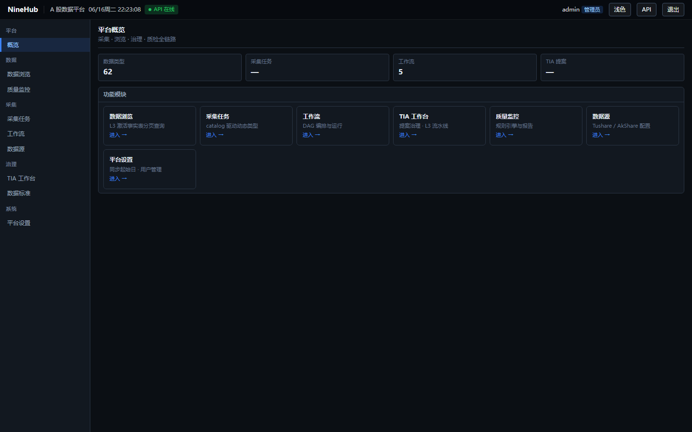

# NineHub

**NineHub** 是面向 A 股场景的 **Catalog-driven 数据管理平台**：以 Catalog 统一数据规格，通过任务与工作流编排采集，TIA 治理接口接入，Query Engine 统一查询，并配套数据质量监控与平台运维能力。

[知乎专栏](https://www.zhihu.com/column/c_2051647988053943380) — 产品介绍、使用教程与更新说明



| 模块 | 路由 | 功能简述 |
|------|------|----------|
| **概览** | `/` | Catalog / 任务 / 工作流 / TIA 规模 KPI，模块快捷入口 |
| **数据浏览器** | `/data-browser` | 三选一提（范围 → 指标 → 时间），证券池 × 多指标宽表截面，模板 / 导出 / 分享 |
| **数据查询** | `/browse` | L3 激活后的单事实表 Catalog 分页浏览 |
| **采集任务** | `/tasks` | Catalog 驱动任务 CRUD、Cron、手动触发与执行日志 |
| **工作流** | `/workflows` | Vue Flow DAG（gate / collect / quality），发布与 Cron 调度 |
| **数据源** | `/sources` | Tushare / AkShare 连接配置与连通性校验 |
| **TIA 工作台** | `/tia` | 接口扫描、提案审批、L3 激活、数据标准与官网覆盖 |
| **质量监控** | `/quality` | 规则引擎、手动 / 定时质检与报告 |
| **平台设置** | `/settings` | 全局同步起始日、用户管理 |

**默认账号**（`init_db` 创建）：`admin` / `admin123456` · **OpenAPI**：<http://127.0.0.1:8888/docs> · **后端操作线 / API 对照**：[backend/README.md](backend/README.md)

---

## 项目目标

| 目标 | 说明 |
|------|------|
| 统一数据服务 | 以 `data_type` + Catalog 描述字段、积分、采集策略，Query Engine 统一对外查询 |
| 可编排采集 | 支持单任务执行与 DAG 工作流（Cron 调度、运行历史、节点状态） |
| TIA 接口治理 | 扫描 Tushare 文档、提案审批、L1/L2/L3 脚手架生成与激活 |
| 可运维可质检 | 数据源管理、执行日志、平台 Job 进度、质量规则与定时报告 |
| 平台与内容分离 | 平台提供引擎与编排；具体 `data_type` 由 TIA L3 激活后动态扩展 |

---

## 主要功能（UI）

登录后通过左侧导航进入各模块。角色分为 **admin**（管理员）与 **normal**（普通用户）；写操作须 `admin`，后端独立校验。

| 模块 | 路由 | 主要能力 | 权限 |
|------|------|----------|------|
| **概览** | `/` | KPI 统计、各模块快捷入口 | 已登录 |
| **数据浏览器** | `/data-browser` | 证券池 × 多指标宽表截面（三选一提），系统/用户模板、导出、分享 | 已登录 |
| **数据查询** | `/browse` | 按 Catalog 类型分页浏览已激活事实表（L3 后出现） | 已登录 |
| **采集任务** | `/tasks` | Catalog 驱动任务 CRUD、手动触发、执行日志 | admin 写；日志可读 |
| **工作流** | `/workflows` | Vue Flow DAG 编辑、Cron 调度、运行历史与节点状态 | 编辑 admin；历史可读 |
| **数据源** | `/sources` | Tushare / AkShare 配置与连通性校验 | admin |
| **TIA 工作台** | `/tia` | 提案治理（扫描/审批/脚手架/激活）、数据标准、官网覆盖对照 | admin |
| **质量监控** | `/quality` | 规则配置、手动/异步触发质检、报告分页 | 触发 admin；报告可读 |
| **平台设置** | `/settings` | 同步起始日、用户禁用等 | admin |

各模块 UI 截图见 [backend/README.md](backend/README.md) 操作线章节；截图位于 `pic/`。

---

## 技术栈

| 层级 | 技术 |
|------|------|
| 后端 | Python 3.10+、FastAPI、SQLAlchemy 2、Alembic、Celery |
| 数据 | PostgreSQL、Redis（Celery Broker） |
| 前端 | Vue 3、Vite、Pinia、Vue Router、Vue Flow |
| 数据源 | Tushare Pro、AkShare |

---

## 环境要求

- **Python** ≥ 3.10
- **Node.js** ≥ 18（前端开发/构建）
- **PostgreSQL** ≥ 14（本地初始化脚本默认连接 `postgres/postgres@localhost:5432`）
- **Redis** ≥ 6（生产与完整异步任务推荐；本地开发可开启 `CELERY_INLINE_FALLBACK=true` 降级为进程内执行）

---

## 安装与部署

### 1. 克隆仓库

```bash
git clone <repo-url> ninehub
cd ninehub
```

### 2. 初始化数据库

确保本机 PostgreSQL 已启动，且存在超级用户 `postgres`（密码默认 `postgres`，可在 `backend/scripts/init_db.py` 顶部修改）。

```bash
cd backend
pip install -e ".[dev]"
python scripts/init_db.py
```

`init_db.py` 将依次完成：

1. 创建项目用户 `ninehub` 与数据库 `ninehub`
2. 写入 `backend/.env`（`DATABASE_URL` 等）
3. 执行 Alembic 迁移（`alembic upgrade head`）
4. 创建管理员 `admin / admin123456`
5. 引导 TIA 文档积分缓存与默认提案种子

### 2.1 2000 积分 A 股采集（Tushare）

多数 A 股接口需 **≥2000 积分**（200 次/分钟）。`init_db` 完成后按以下顺序配置（详见 [backend/README.md — 2000 积分 A 股采集部署](backend/README.md#2000-积分-a-股采集部署)）：

1. **数据源**：Token + `account_points: 2000`（UI「数据源」；勿仅用 `.env` 默认 120）
2. **平台设置**：`sync_start_date`（如 `2020-01-01`）
3. **TIA L3 激活**：扫描 → 审批 → 激活事实表（P0：`bootstrap_browser_p0.py`）
4. **工作流与采集配置**：`python scripts/setup_collect_workflows.py --migrate --backfill-plan`（32 个 API override + 5 条 DAG / 31 节点；`--migrate` 可省略若 `init_db` 已最新）
5. **历史回填**：`python scripts/run_backfill_history.py --list` 后按 tier 或 `--all` 执行

工作流日批 API 预算 **200 次/节点**；`stk_holdertrade` 接口独立限速 100 次/分钟，大规模历史须 `--from-chunk` 续跑。

### 3. 启动后端 API

```bash
cd backend
uvicorn app.main:app --host 127.0.0.1 --port 8888 --reload
```

健康检查：`GET http://127.0.0.1:8888/health`

### 4. 前端

**开发模式**（热更新，API 代理到 8888）：

```bash
cd frontend
npm install
npm run dev    # http://localhost:5173
```

**生产构建**（由 FastAPI 托管静态资源）：

```bash
cd frontend
npm run build  # 输出到 backend/static/
```

然后访问 <http://127.0.0.1:8888/> 即可进入 SPA。

### 5. Celery Worker / Beat（可选，推荐生产）

采集、TIA 扫描、工作流节点、定时质检等长任务依赖 Celery。需先启动 Redis，再在 `backend` 目录执行：

```bash
# 终端 1 — Worker
celery -A app.tasks.celery_app worker --loglevel=info

# 终端 2 — Beat（Cron 调度、每日 18:00 质检等）
celery -A app.tasks.celery_app beat --loglevel=info
```

本地快速体验可不启 Worker：`.env` 中 `CELERY_INLINE_FALLBACK=true`（`init_db` 默认值）时，部分任务会在 API 进程内同步执行。

### 6. Docker Compose（可选）

仓库根目录提供 `docker-compose.yml`，一键拉起 PostgreSQL、Redis、API、Worker、Beat：

```bash
docker compose up -d
```

首次启动后仍需在 API 容器内执行迁移与种子（或在本机对容器数据库运行 `init_db.py`）。Docker Compose 数据库账号为 `ninehub/ninehub`；本机 `init_db.py` 写入 `.env` 的密码为 `ninehub_dev`（见脚本顶部 `PROJECT_PASSWORD`）。

---

## 目录结构

```
ninehub/
├── backend/              # FastAPI、Celery、迁移与脚本（见 backend/README.md）
├── frontend/src/         # Vue 3 源码
├── pic/                  # UI 截图（README 引用）
├── docker-compose.yml
└── AGENTS.md             # 开发 Agent 指南
```

---

## 常用命令

```bash
# 后端测试
cd backend && pytest tests -v -p no:pytest_postgresql

# 2000 积分采集链路（L3 激活后）
cd backend
python scripts/setup_collect_workflows.py --check-only
python scripts/setup_collect_workflows.py --migrate --backfill-plan
python scripts/run_backfill_history.py --list  # 历史回填计划

# 代码格式化
cd backend && black app tests

# UI 截图（需 API :8888 + 前端 :5173）
python scripts/capture_ui_screenshots.py
python scripts/capture_browser_screenshots.py
```

---

## 注意事项

- **Tushare Token**：在「数据源」页配置 Token 与 **account_points**（2000 积分 A 股链路须填 `2000`）后方可采集；请妥善保管 Token，勿提交到版本库。
- **生产部署**：务必修改 `SECRET_KEY`、数据库密码，并将 `DEBUG=false`、`CELERY_INLINE_FALLBACK=false`。
- **RBAC**：前端菜单按角色隐藏，但所有写接口后端均独立校验，不可仅依赖前端权限。
