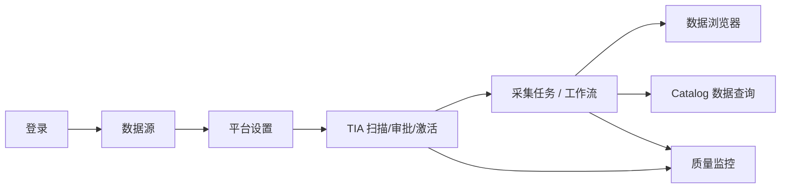

# NineHub Backend

FastAPI + Celery + PostgreSQL 驱动的 **A 股 Catalog 数据平台**后端：REST API（`/api/v1`）、长任务调度（`platform_jobs`）、Catalog 查询引擎、TIA 治理流水线，以及 Vue SPA 前端（开发 `:5173`，生产托管于 `static/`）。

## 系统概览

平台以 **Catalog + TIA L3** 扩展数据类型，用 **任务 / 工作流** 编排采集，用 **数据浏览器 / Catalog 查询** 统一消费，并配套 **质量监控** 与 **运维配置**。除登录与健康检查外，API 需 JWT；写操作需 `admin` 角色。


| 模块 | 路由 | 功能简述 |
|------|------|----------|
| **概览** | `/` | Catalog / 任务 / 工作流 / TIA 规模 KPI，模块快捷入口 |
| **数据浏览器** | `/data-browser` | 三选一提（范围 → 指标 → 时间），证券池 × 多指标宽表截面，模板 / 导出 / 分享 |
| **数据查询** | `/browse` | L3 激活后的单事实表 Catalog 分页浏览 |
| **采集任务** | `/tasks` | Catalog 驱动任务 CRUD、Cron、手动触发与执行日志 |
| **工作流** | `/workflows` | Vue Flow DAG（gate / collect / quality），发布与 Cron 调度 |
| **数据源** | `/sources` | Tushare / AkShare 连接配置与连通性校验 |
| **TIA 工作台** | `/tia` | 接口扫描、提案审批、L3 激活、数据标准与官网覆盖 |
| **质量监控** | `/quality` | 规则引擎、手动 / 定时质检与报告 |
| **平台设置** | `/settings` | 全局同步起始日、用户管理 |

**默认账号**（`init_db` 创建）：`admin` / `admin123456` · **OpenAPI**：<http://127.0.0.1:8888/docs>

各模块 UI 截图见下文「操作线」；截图文件位于仓库根目录 `pic/`。更新截图：

```bash
python ../scripts/capture_ui_screenshots.py
python ../scripts/capture_browser_screenshots.py
```

---

## 快速启动

### 环境要求

- Python ≥ 3.10
- PostgreSQL ≥ 14
- Redis ≥ 6（生产 / 完整异步任务；本地可 `CELERY_INLINE_FALLBACK=true`）

### 初始化数据库

```bash
cd backend
pip install -e ".[dev]"
python scripts/init_db.py
```

脚本将创建库用户 `ninehub`、写入 `.env`、执行 Alembic 迁移、种子管理员 `admin / admin123456`，并引导 TIA 文档积分缓存与默认提案。

### 启动服务

```bash
# API（必选）
uvicorn app.main:app --host 127.0.0.1 --port 8888 --reload

# Celery（采集 / TIA / 工作流 / 定时质检，生产推荐）
celery -A app.tasks.celery_app worker --loglevel=info
celery -A app.tasks.celery_app beat --loglevel=info
```

| 检查项 | 地址 |
|--------|------|
| 健康检查 | `GET /health` |
| OpenAPI | <http://127.0.0.1:8888/docs> |
| 前端开发 | `cd ../frontend && npm run dev` → <http://localhost:5173> |

---

## 操作线（推荐上手顺序）

以下按 **首次部署后的典型运维路径** 排列，与 UI 侧栏及 `pic/` 截图一一对应。除登录与健康检查外，请求均须 `Authorization: Bearer <token>`；写操作须 `admin` 角色。

```
登录 → 概览 → 数据源 → 平台设置 → TIA 治理 → 采集/工作流 → 数据浏览器 → 质量监控
```

### 0. 登录


| UI | API |
|----|-----|
| 填写 API 地址、用户名、密码 | `POST /api/v1/auth/login` |
| 进入主壳层 | `GET /api/v1/auth/me` |

开发时前端 `:5173` 通过 Vite 代理 `/api` → `:8888`；生产由 FastAPI 托管 `static/` 同源访问。

---

### 1. 平台概览


| UI | API |
|----|-----|
| KPI：数据类型 / 任务 / 工作流 / TIA 提案 | `GET /api/v1/catalog/data-types`、`GET /api/v1/tasks`、`GET /api/v1/workflows`、`GET /api/v1/tia/proposals` |
| Schema 就绪率、L3 激活率 | `GET /api/v1/catalog/data-standards?limit=1` |
| 模块快捷入口 | 跳转各功能路由 |

概览用于确认 Catalog 规模与治理进度，再进入具体模块。

---

### 2. 配置数据源（采集前置）


| UI | API |
|----|-----|
| 新建 Tushare / AkShare 连接 | `POST /api/v1/sources` |
| 连通性校验 | `POST /api/v1/sources/verify` |
| 列表 / 编辑 / 删除 | `GET/PUT/DELETE /api/v1/sources/{id}` |

`GET` 响应中 `config.token` 已掩码；`PUT` 时 token 留空保留原值。Tushare 采集与 TIA Preflight 均依赖有效 Token 与账号积分。

---

### 3. 平台设置


| UI | API |
|----|-----|
| 全局同步起始日 | `GET/PUT /api/v1/platform/settings` |
| 用户列表 / 禁用 | `GET /api/v1/auth/users`、`PATCH /api/v1/auth/users/{id}` |

`sync_start_date` 影响增量采集起点；与任务级 `collect-config` 覆盖配合使用。

---

### 4. TIA 治理（Catalog 扩展核心）

TIA 将外部接口治理为平台可运行的 `data_type`：**扫描提案 → 审批 → L3 激活 → 开通浏览**。

#### 4a. 提案治理


| UI | API |
|----|-----|
| 开始扫描 | `POST /api/v1/tia/scan` → 轮询 `GET /api/v1/tia/scan/{job_id}` 或 `GET /api/v1/platform/jobs/{job_id}` |
| 积分审计 | `POST /api/v1/tia/audit` |
| 提案列表 / 筛选 | `GET /api/v1/tia/proposals` |
| Preflight 测试 | `POST /api/v1/tia/proposals/{id}/preflight-test` |
| 批准 / 拒绝 | `PATCH /api/v1/tia/proposals/{id}` |
| 批准并激活（L3） | `POST /api/v1/tia/proposals/{id}/approve-activate` |
| L3 激活 / 重试 | `POST /api/v1/tia/proposals/{id}/activate` |
| 开通数据浏览 | `POST /api/v1/tia/proposals/{id}/enable-browse` |
| L2 脚手架下载 | `GET /api/v1/tia/proposals/{id}/scaffold` |

L3 激活成功后：注册 SyncHandler、创建/迁移事实表、写入 Catalog；侧栏「数据浏览」在 `browse_enabled=true` 后出现。

#### 4b. 数据标准


| UI | API |
|----|-----|
| Schema 对照清单 | `GET /api/v1/catalog/data-standards` |
| 字段明细 / 漂移 | `GET /api/v1/catalog/data-standards/{api_name}`、`GET .../drift` |
| 批量导出契约 | `GET /api/v1/catalog/data-standards/export` |

#### 4c. 官网覆盖


| UI | API |
|----|-----|
| 计划规格 vs 官网索引 | `GET /api/v1/catalog/coverage` |

---

### 5. 采集任务


| UI | API |
|----|-----|
| 任务列表（catalog 动态类型） | `GET /api/v1/tasks` |
| 创建 / 更新任务 | `POST /api/v1/tasks`、`PUT /api/v1/tasks/{id}` |
| 采集参数（task_overrides） | `GET/PUT /api/v1/tasks/{id}/collect-config` |
| 手动执行 | `POST /api/v1/tasks/{id}/run` |
| 执行日志 | `GET /api/v1/tasks/{id}/runs` |
| 可选数据类型 | `GET /api/v1/tasks/data-types` |

任务 Cron 由 Beat 扫描 `sync_tasks` 调度；长任务进度见 `task_runs` 与 `platform_jobs`。

---

### 6. 工作流（DAG 编排）


| UI | API |
|----|-----|
| 列表 / 新建 / 克隆模板 | `GET/POST /api/v1/workflows`、`POST .../clone` |
| 图结构（draft 可编辑） | `GET/PUT /api/v1/workflows/{id}/graph` |
| 节点属性 | `PATCH /api/v1/workflows/{id}/nodes/{node_id}` |
| DAG 校验 | `GET /api/v1/workflows/{id}/validate` |
| 发布 / 取消发布 | `POST .../publish`、`POST .../unpublish` |
| 运行 / 调试 | `POST /api/v1/workflows/{id}/run` |
| 运行历史 / 节点状态 | `GET .../runs`、`GET /api/v1/workflows/runs/{run_id}/nodes` |

节点类型：`gate` | `collect` | `quality`（见 `services/workflow/nodes/registry.py`）。`published` 工作流支持 Cron（如 `0 8 * * 1-5` 工作日盘前）。

---

### 7. 数据浏览器（三选一提宽表）

Wind 风格 **证券池 × 多指标截面宽表**：向导三步（选范围 → 选指标 → 选时间），支持系统/用户模板、CSV/XLSX 导出、分享链接与查询审计。路由 `/data-browser`；指标定义来自 `app/catalog/browser_indicators.yaml`，禁止前端硬编码业务字段。

#### 7a. 选范围


| UI | API |
|----|-----|
| 预设维度（全 A/B/AB、交易所、申万、指数成分等） | `GET /api/v1/query/browser/meta` → `dimensions` |
| 自定义代码列表 | `POST /api/v1/query/browser/universe/preview` |
| 自选股证券池 CRUD | `GET/POST/PUT/DELETE /api/v1/query/browser/watchlists` |

#### 7b. 选指标


| UI | API |
|----|-----|
| 指标树 / 搜索（拼音、标签） | `GET /api/v1/query/browser/meta`、`GET .../meta/indicators?q=` |
| 系统模板（如 OHLC 演示） | `meta.system_templates` |
| 用户模板 CRUD | `GET/POST/PUT/DELETE /api/v1/query/browser/templates` |

#### 7c. 选时间并提取


| UI | API |
|----|-----|
| 单/多截面、财报对齐 | 请求体 `as_of_date` / `dates` / `financial_align` |
| P0 就绪门禁（admin 顶栏） | `GET /api/v1/query/browser/readiness` |
| 执行宽表查询 | `POST /api/v1/query/browser/execute` |
| 同步/异步导出 | `POST /api/v1/query/browser/export` → `GET .../exports/{job_id}/download` |
| 分享查询定义 | `POST /api/v1/query/browser/share` → `GET .../share/{token}` |
| 查询审计 | `GET /api/v1/query/browser/audit` |

#### 7d. 结果：表格与图表


| UI | API |
|----|-----|
| 分页、排序、列统计 | `execute` 请求 `skip` / `limit` / `sort` |
| 柱状/散点/折线（多截面） | 前端 ECharts；数据仍来自 `execute` |
| 强制刷新（跳过缓存） | `execute` + `force_refresh=true` |

**首次部署数据准备**（P0 门禁，admin 可读 readiness）：

```bash
cd backend
python scripts/bootstrap_browser_p0.py      # L3 激活 daily / trade_cal / stock_basic 等
python scripts/backfill_browser_daily.py    # 历史日线回填（可选）
python scripts/check_browser_data_readiness.py
```

P1 申万/指数扩展（非门禁，见 readiness `warnings`）：`bootstrap_browser_shenwan.py`、`bootstrap_browser_index.py`。

与旧版 Catalog 分页浏览（`/browse`，见下节）并存：数据浏览器面向 **多表 join 宽表**；`/browse` 面向 **单事实表 Catalog 分页**。

---

### 8. 数据查询（Catalog 事实表，L3 之后）


| UI | API |
|----|-----|
| 可浏览表清单 | `GET /api/v1/catalog/data-types`（`browse_enabled=true`） |
| 分页查询事实表 | `GET /api/v1/catalog/data/{data_type}?skip=&limit=&...` |

列定义来自 Catalog，禁止前端硬编码业务字段。

---

### 9. 质量监控


| UI | API |
|----|-----|
| 规则列表 / 新建 | `GET/POST /api/v1/quality/rules` |
| 启用 / 禁用 | `PATCH /api/v1/quality/rules/{id}` |
| Catalog 规则建议 | `GET /api/v1/catalog/data-standards/by-data-type/{data_type}/quality-suggestions` |
| 手动触发质检 | `POST /api/v1/quality/run` |
| 报告分页 | `GET /api/v1/quality/reports` |

Beat 每日 18:00 执行 `ninehub.run_quality_check`；失败可配置 webhook 告警。

---

## 操作线总览



| 阶段 | 后端落点 | 主要表 |
|------|----------|--------|
| 认证 | `app/api/v1/endpoints/auth.py` | `users` |
| 数据源 | `endpoints/sources.py` | `data_sources` |
| TIA | `endpoints/tia.py` + `services/tia/` | `tia_proposals`, `platform_jobs` |
| 采集 | `endpoints/tasks.py` + `sync/` | `sync_tasks`, `task_runs` |
| 工作流 | `endpoints/workflows.py` + `services/workflow/` | `workflows`, `workflow_runs`, `node_runs` |
| 数据浏览器 | `endpoints/query_browser.py` + `services/query/` | `browser_templates`, `browser_watchlists`, `browser_query_audit` + 动态事实表 |
| Catalog 查询 | `endpoints/catalog.py` + Query Engine | 动态事实表 |
| 质检 | `endpoints/quality.py` | `quality_rules`, `quality_reports` |

---

## 代码结构

```
backend/
├── app/
│   ├── api/v1/endpoints/   # auth, catalog, query_browser, sources, tasks, workflows, tia, quality, platform
│   ├── catalog/            # registry, browser_indicators.yaml, tushare_catalog, official_index
│   ├── core/               # config, database, security, deps
│   ├── models/             # SQLAlchemy 模型
│   ├── services/           # 领域服务（按包拆分）
│   ├── sync/               # SyncHandler, SyncExecutor, DataLoader
│   └── tasks/              # Celery 任务定义
├── migrations/             # Alembic
├── scripts/                # init_db.py 等
├── static/                 # 前端构建产物（生产）
└── tests/
```

---

## 配置（`.env` 摘要）

| 变量 | 说明 |
|------|------|
| `DATABASE_URL` | 异步 API 连接（`postgresql+asyncpg://...`） |
| `SYNC_DATABASE_URL` | Celery 同步连接（`postgresql+psycopg2://...`） |
| `SECRET_KEY` | JWT 签名密钥 |
| `CELERY_BROKER_URL` / `CELERY_RESULT_BACKEND` | Redis |
| `CELERY_INLINE_FALLBACK` | `true` 时 API 进程内同步执行部分任务（本地默认） |
| `BROWSER_QUERY_CACHE_TTL` | 数据浏览器查询结果缓存秒数（默认 300） |

---

## 测试与工具

```bash
# 单元 / 集成测试
pytest tests -v -p no:pytest_postgresql

# 格式化
black app tests

# UI 截图（需前端 dev + 本机 API 运行）
python ../scripts/capture_ui_screenshots.py
python ../scripts/capture_browser_screenshots.py   # 数据浏览器三步骤 + 结果
```
