# NineHub Backend

FastAPI + Celery + PostgreSQL 驱动的 **A 股 Catalog 数据平台**后端：REST API（`/api/v1`）、长任务调度（`platform_jobs`）、Catalog 查询引擎、TIA 治理流水线，以及 Vue SPA 前端（开发 `:5173`，生产托管于 `static/`）。

## 系统概览

平台以 **Catalog + TIA L3** 扩展数据类型，用 **任务 / 工作流** 编排采集，用 **数据浏览器 / Catalog 查询** 统一消费，并配套 **质量监控** 与 **运维配置**。除登录与健康检查外，API 需 JWT；写操作需 `admin` 角色。


| 模块 | 路由 | 功能简述 |
|------|------|----------|
| **概览** | `/` | Catalog / 任务 / 工作流 / TIA 规模 KPI，模块快捷入口 |
| **数据浏览器** | `/data-browser` | 三选一提（范围 → 指标 → 时间），证券池 × 多指标宽表截面，模板 / 导出 / 分享 |
| **数据查询** | `/browse` | L3 激活后的单事实表 Catalog 分页浏览 |
| **采集任务** | `/tasks` | Catalog 驱动任务 CRUD、Cron、手动触发与执行日志 |
| **工作流** | `/workflows` | Vue Flow DAG（gate / collect / quality），发布与 Cron 调度 |
| **数据源** | `/sources` | Tushare / AkShare 连接配置与连通性校验 |
| **TIA 工作台** | `/tia` | 接口扫描、提案审批、L3 激活、数据标准与官网覆盖 |
| **质量监控** | `/quality` | 规则引擎、手动 / 定时质检与报告 |
| **平台设置** | `/settings` | 全局同步起始日、用户管理 |

**默认账号**（`init_db` 创建）：`admin` / `admin123456` · **OpenAPI**：<http://127.0.0.1:8888/docs>

各模块 UI 截图见下文「操作线」；截图文件位于仓库根目录 `pic/`。更新截图：

```bash
python ../scripts/capture_ui_screenshots.py
python ../scripts/capture_browser_screenshots.py
```

---

## 快速启动

### 环境要求

- Python ≥ 3.10
- PostgreSQL ≥ 14
- Redis ≥ 6（生产 / 完整异步任务；本地可 `CELERY_INLINE_FALLBACK=true`）

### 初始化数据库

```bash
cd backend
pip install -e ".[dev]"
python scripts/init_db.py
```

脚本将创建库用户 `ninehub`、写入 `.env`、执行 Alembic 迁移、种子管理员 `admin / admin123456`，并引导 TIA 文档积分缓存与默认提案。

**2000 积分 A 股采集**（L3 激活后）见 [数据初始化与历史加载](#数据初始化与历史加载) 与 [§2000 积分 A 股采集部署](#2000-积分-a-股采集部署)。

### 启动服务

```bash
# API（必选）
uvicorn app.main:app --host 127.0.0.1 --port 8888 --reload

# Celery（采集 / TIA / 工作流 / 定时质检，生产推荐）
celery -A app.tasks.celery_app worker --loglevel=info
celery -A app.tasks.celery_app beat --loglevel=info
```

| 检查项 | 地址 |
|--------|------|
| 健康检查 | `GET /health` |
| OpenAPI | <http://127.0.0.1:8888/docs> |
| 前端开发 | `cd ../frontend && npm run dev` → <http://localhost:5173> |

---

## 数据初始化与历史加载

以下命令均在 **`backend/`** 目录执行。推荐按阶段顺序完成；各阶段可单独 `--check-only` 预检。

### 阶段 0：平台初始化

```bash
cd backend
pip install -e ".[dev]"
python scripts/init_db.py          # 建库、迁移、admin 种子、TIA 文档缓存
```

`init_db.py` 完成：创建用户/库、写入 `.env`、Alembic `upgrade head`、管理员 `admin / admin123456`、TIA 默认提案种子。

启动 API 与 Celery（生产推荐 Worker + Beat）：

```bash
uvicorn app.main:app --host 127.0.0.1 --port 8888 --reload
celery -A app.tasks.celery_app worker --loglevel=info
celery -A app.tasks.celery_app beat --loglevel=info
```

### 阶段 1：数据源与平台参数

在 UI「数据源」创建 Tushare 连接（**须**填写 `token` + `account_points: 2000`）；在「平台设置」配置 **`sync_start_date`**（如 `2020-01-01`）——历史回填与增量采集均以此为下界。

TDX Sidecar（可选）：在「数据源」创建 `provider=tdx`，配置 `config.base_url` 指向 Sidecar 服务。

### 阶段 2：TIA L3 激活

**P0 — 数据浏览器门禁**（trade_cal / stock_basic / daily 等）：

```bash
python scripts/bootstrap_browser_p0.py
python scripts/check_browser_data_readiness.py
```

**Tushare 工作流 API**（L3 预检失败或 `tia_overrides` 缺失时）：

```bash
python scripts/bootstrap_tia_apis.py --missing-workflows   # 补全 31 个 Tushare 工作流 API
python scripts/bootstrap_tia_apis.py fina_indicator stk_limit stk_managers  # 指定 API
```

**P1 — 申万 / 指数**（各需 ≥2000 积分，非 P0 门禁）：

```bash
python scripts/bootstrap_browser_shenwan.py
python scripts/bootstrap_browser_index.py
```

**TDX Sidecar**（bar / 概念板块，与 Tushare 分开激活）：

```bash
python scripts/bootstrap_tdx_bar_1d.py --apis bar_1d bar_1m bar_5m concept_index concept_member
```

也可在 TIA 工作台 UI 完成：扫描 → Preflight → 批准 → L3 激活。

### 阶段 3：工作流与采集配置

**Tushare（31 个 API + 5 条 DAG）**：

```bash
python scripts/setup_collect_workflows.py --check-only              # 预检：积分 / override
python scripts/setup_collect_workflows.py --migrate --backfill-plan # 迁移 + override + 种子 DAG + 回填计划
python scripts/setup_collect_workflows.py --replace-workflows       # 重建 01–05 工作流
```

分步等价：

```bash
python scripts/apply_workflow_daily_batch.py
python scripts/seed_tia_workflows.py
python scripts/seed_tia_workflows.py --replace   # 强制重建
```

**TDX（5 个 API + TDX 工作流）**：

```bash
python scripts/setup_tdx_workflows.py --check-only
python scripts/setup_tdx_workflows.py
python scripts/setup_tdx_workflows.py --replace-workflows
```

### 阶段 4：历史数据加载

**查看回填计划**（推荐第一步）：

```bash
python scripts/run_backfill_history.py --list
python scripts/setup_collect_workflows.py --backfill-plan
```

**Tushare 全量历史**（从 `sync_start_date` 起，按 tier 分层；tier 0 须先跑）：

```bash
python scripts/run_backfill_history.py --tier 0    # 交易日历 + 股票列表 + 申万/指数
python scripts/run_backfill_history.py --tier 1    # 日频行情（daily / daily_basic / adj_factor 等）
python scripts/run_backfill_history.py --tier 2    # 周频 / 新股等
python scripts/run_backfill_history.py --tier 3    # 财报 / 公司信息
python scripts/run_backfill_history.py --tier 4    # 股东 / 质押 / 分红等（按 API 轮换，较慢）
```

**单表 / 续跑 / 重载**：

```bash
python scripts/run_backfill_history.py --data-type tushare_daily
python scripts/run_backfill_history.py --data-type tushare_fina_indicator
python scripts/run_backfill_history.py --data-type tushare_stk_managers
python scripts/run_backfill_history.py --data-type tushare_stk_holdertrade --from-chunk 21  # 中断续跑
python scripts/run_backfill_history.py --data-type tushare_daily --truncate               # 清表后全量重载
python scripts/run_backfill_history.py --all --dry-run                                    # 预览，不调用 API
```

| 参数 | 默认 | 说明 |
|------|------|------|
| chunk 预算 | 200 | 与 `DAILY_MAX_API_CALLS` 一致 |
| `--chunk-days` | 100 | 每 chunk 交易日数（`trade_date` 策略） |
| `--from-chunk` | 1 | 续跑（如 holdertrade 第 21 轮 ≈ 偏移 2000 代码） |
| `--truncate` | off | 清表后全量重载（tier 1+ 时保留 tier-0 代码表） |

进度：`logs/backfill_history.log`；任务：`platform_jobs`（`job_type=history_backfill`）。

**数据浏览器快速日线**（仅最近若干交易日，P0 演示用）：

```bash
python scripts/backfill_browser_daily.py       # 默认最近 5 个交易日
python scripts/check_browser_data_readiness.py
```

**TDX vipdoc 历史导入**（本地通达信数据，需 Sidecar + L3 已激活）：

```bash
python scripts/import_tdx_vipdoc.py --data-type tdx_bar_1d
python scripts/import_tdx_vipdoc.py --period 1d --start-date 2020-01-01 --end-date 2025-12-31 --direct
python scripts/import_tdx_vipdoc.py --period 1m --data-type tdx_bar_1m
```

**工作流 UI**（小范围补数）：手动运行 published DAG，选 `batch_mode=backfill`。单次受 200 次 API 预算限制，**不适合**从 `sync_start_date` 起的全量历史；全量请用 `run_backfill_history.py`。

### 阶段 5：日常增量

- **Tushare 日批**：Celery Beat 按工作流 Cron（如 `0 18 * * 1-5`）触发，或 UI 手动运行
- **质检**：Beat 每日 18:00 `run_quality_check`
- **Schema 漂移**：TIA 工作台 → Schema 维护（如 `daily` 补列 `ah_vol` / `ah_amount`）；必要时 `alembic upgrade head`

### 一键速查（新装环境）

```bash
cd backend
python scripts/init_db.py
# → UI：数据源（token + 2000 积分）、sync_start_date
python scripts/bootstrap_browser_p0.py
python scripts/bootstrap_tia_apis.py --missing-workflows
python scripts/setup_collect_workflows.py --migrate --backfill-plan
python scripts/run_backfill_history.py --list
python scripts/run_backfill_history.py --tier 0
python scripts/run_backfill_history.py --tier 1
# tier 2–4 按需；TDX 见 bootstrap_tdx_bar_1d.py + setup_tdx_workflows.py
python scripts/check_browser_data_readiness.py
```

---

## 操作线（推荐上手顺序）

以下按 **首次部署后的典型运维路径** 排列，与 UI 侧栏及 `pic/` 截图一一对应。除登录与健康检查外，请求均须 `Authorization: Bearer <token>`；写操作须 `admin` 角色。

```
登录 → 概览 → 数据源 → 平台设置 → TIA 治理 → 采集/工作流 → 数据浏览器 → 质量监控
```

### 0. 登录

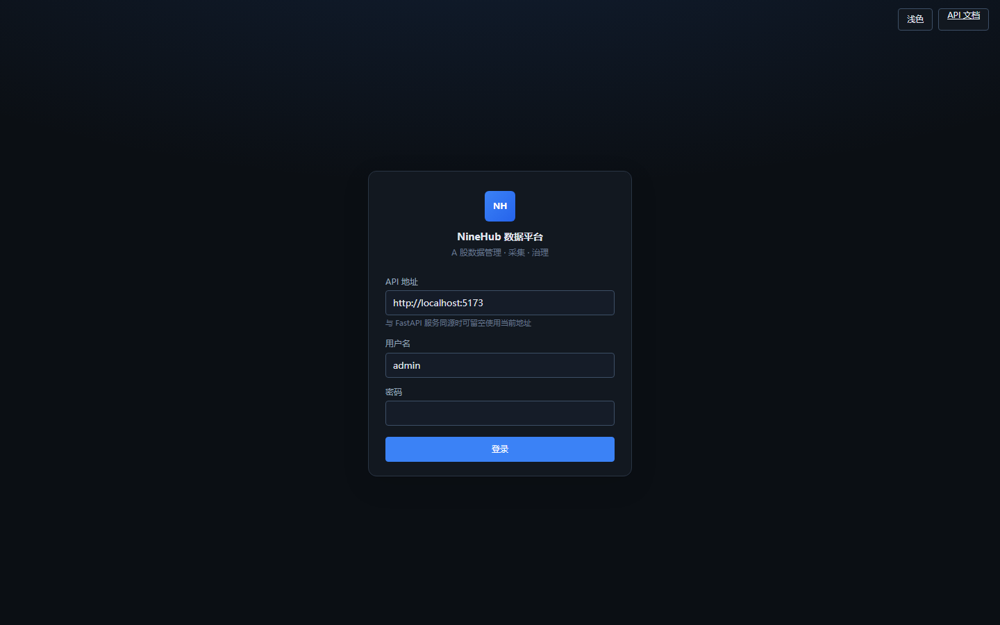

| UI | API |
|----|-----|
| 填写 API 地址、用户名、密码 | `POST /api/v1/auth/login` |
| 进入主壳层 | `GET /api/v1/auth/me` |

开发时前端 `:5173` 通过 Vite 代理 `/api` → `:8888`；生产由 FastAPI 托管 `static/` 同源访问。

---

### 1. 平台概览


| UI | API |
|----|-----|
| KPI：数据类型 / 任务 / 工作流 / TIA 提案 | `GET /api/v1/catalog/data-types`、`GET /api/v1/tasks`、`GET /api/v1/workflows`、`GET /api/v1/tia/proposals` |
| Schema 就绪率、L3 激活率 | `GET /api/v1/catalog/data-standards?limit=1` |
| 模块快捷入口 | 跳转各功能路由 |

概览用于确认 Catalog 规模与治理进度，再进入具体模块。

---

### 2. 配置数据源（采集前置）

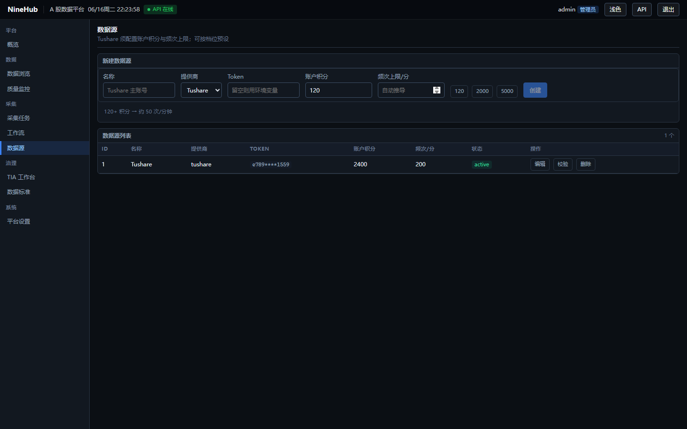

| UI | API |
|----|-----|
| 新建 Tushare / AkShare 连接 | `POST /api/v1/sources` |
| 连通性校验 | `POST /api/v1/sources/verify` |
| 列表 / 编辑 / 删除 | `GET/PUT/DELETE /api/v1/sources/{id}` |

`GET` 响应中 `config.token` 已掩码；`PUT` 时 token 留空保留原值。Tushare 采集与 TIA Preflight 均依赖有效 Token 与账号积分。

---

### 3. 平台设置

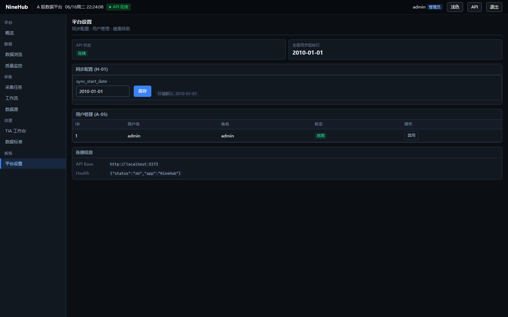

| UI | API |
|----|-----|
| 全局同步起始日 | `GET/PUT /api/v1/platform/settings` |
| 用户列表 / 禁用 | `GET /api/v1/auth/users`、`PATCH /api/v1/auth/users/{id}` |

`sync_start_date` 影响增量采集起点；与任务级 `collect-config` 覆盖配合使用。

---

### 4. TIA 治理（Catalog 扩展核心）

TIA 将外部接口治理为平台可运行的 `data_type`：**扫描提案 → 审批 → L3 激活 → 开通查询**。

#### 4a. 提案治理

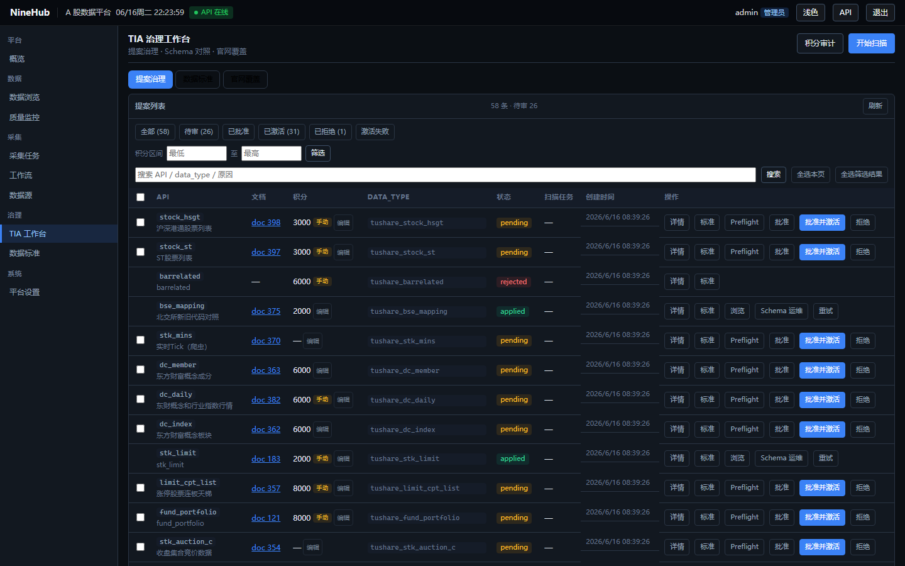

| UI | API |
|----|-----|
| 开始扫描 | `POST /api/v1/tia/scan` → 轮询 `GET /api/v1/tia/scan/{job_id}` 或 `GET /api/v1/platform/jobs/{job_id}` |
| 积分审计 | `POST /api/v1/tia/audit` |
| 提案列表 / 筛选 | `GET /api/v1/tia/proposals` |
| Preflight 测试 | `POST /api/v1/tia/proposals/{id}/preflight-test` |
| 批准 / 拒绝 | `PATCH /api/v1/tia/proposals/{id}` |
| 批准并激活（L3） | `POST /api/v1/tia/proposals/{id}/approve-activate` |
| L3 激活 / 重试 | `POST /api/v1/tia/proposals/{id}/activate` |
| 开通数据查询 | `POST /api/v1/tia/proposals/{id}/enable-browse` |
| L2 脚手架下载 | `GET /api/v1/tia/proposals/{id}/scaffold` |

L3 激活成功后：注册 SyncHandler、创建/迁移事实表、写入 Catalog；侧栏「数据查询」在 `browse_enabled=true` 后出现。

#### 4b. 数据标准

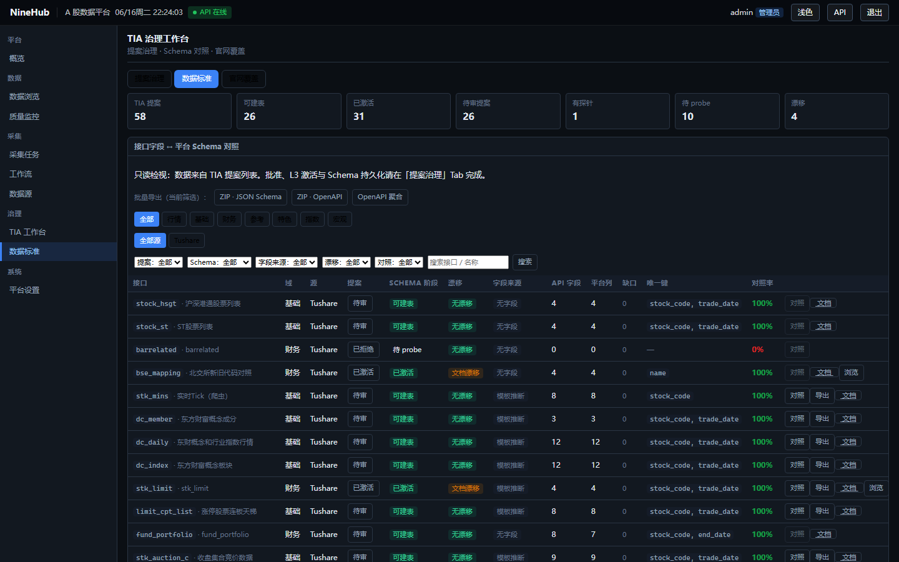

| UI | API |
|----|-----|
| Schema 对照清单 | `GET /api/v1/catalog/data-standards` |
| 字段明细 / 漂移 | `GET /api/v1/catalog/data-standards/{api_name}`、`GET .../drift`（上游增列时如 `daily` → `ah_vol` / `ah_amount`） |
| 批量导出契约 | `GET /api/v1/catalog/data-standards/export` |

#### 4c. 官网覆盖

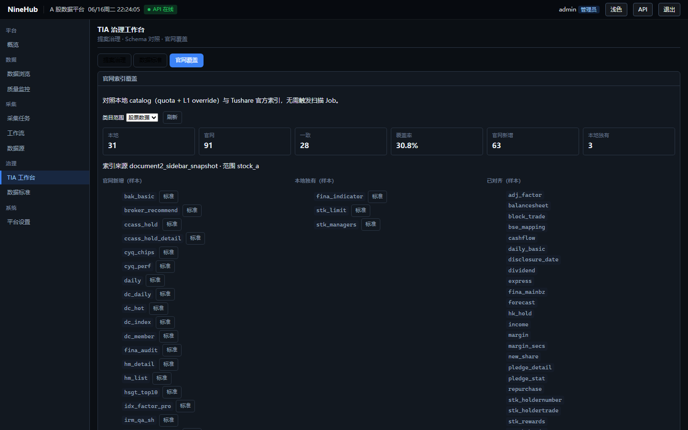

| UI | API |
|----|-----|
| 计划规格 vs 官网索引 | `GET /api/v1/catalog/coverage` |

---

### 5. 采集任务

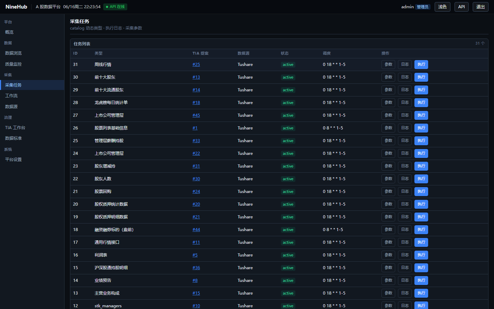

| UI | API |
|----|-----|
| 任务列表（catalog 动态类型） | `GET /api/v1/tasks` |
| 创建 / 更新任务 | `POST /api/v1/tasks`、`PUT /api/v1/tasks/{id}` |
| 采集参数（task_overrides） | `GET/PUT /api/v1/tasks/{id}/collect-config` |
| 手动执行 | `POST /api/v1/tasks/{id}/run` |
| 执行日志 | `GET /api/v1/tasks/{id}/runs` |
| 可选数据类型 | `GET /api/v1/tasks/data-types` |

任务 Cron 由 Beat 扫描 `sync_tasks` 调度；长任务进度见 `task_runs` 与 `platform_jobs`。

---

### 6. 工作流（DAG 编排）

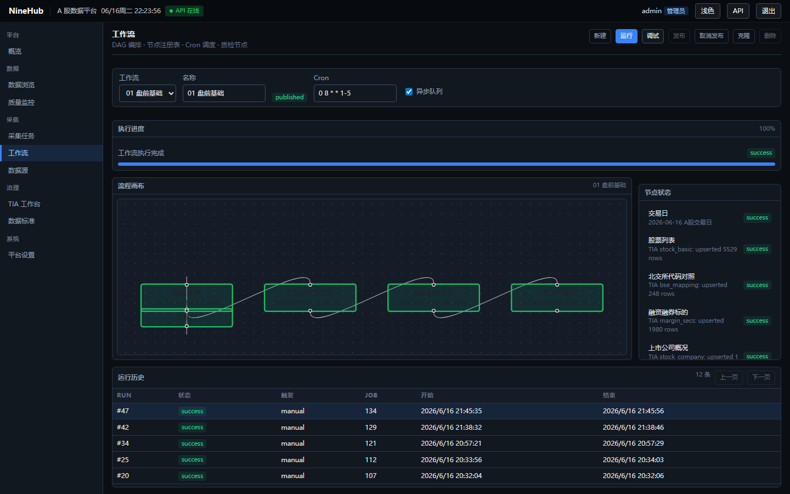

| UI | API |
|----|-----|
| 列表 / 新建 / 克隆模板 | `GET/POST /api/v1/workflows`、`POST .../clone` |
| 图结构（draft 可编辑） | `GET/PUT /api/v1/workflows/{id}/graph` |
| 节点属性 | `PATCH /api/v1/workflows/{id}/nodes/{node_id}` |
| DAG 校验 | `GET /api/v1/workflows/{id}/validate` |
| 发布 / 取消发布 | `POST .../publish`、`POST .../unpublish` |
| 运行 / 调试 | `POST /api/v1/workflows/{id}/run` |
| 采集策略（只读） | `GET /api/v1/workflows/collect-profile?data_type=&batch_mode=daily` |
| 运行历史 / 节点状态 | `GET .../runs`、`GET /api/v1/workflows/runs/{run_id}/nodes` |

L3 激活后种子 5 条 published DAG：`python scripts/setup_collect_workflows.py`（或 `seed_tia_workflows.py`）。Collect Profile 展示平台对 `daily` / `backfill` 生效的 mode 与 API 预算。

节点类型：`gate` | `collect` | `quality`（见 `services/workflow/nodes/registry.py`）。`published` 工作流支持 Cron（如 `0 8 * * 1-5` 工作日盘前）。

---

### 7. 数据浏览器（三选一提宽表）

Wind 风格 **证券池 × 多指标截面宽表**：向导三步（选范围 → 选指标 → 选时间），支持系统/用户模板、CSV/XLSX 导出、分享链接与查询审计。路由 `/data-browser`；指标定义来自 `app/catalog/browser_indicators.yaml`，禁止前端硬编码业务字段。日线常用指标含 OHLC、`vol` / `amount`，以及 2025-07-07 起 Tushare `daily` 新增的 **`ah_vol`（盘后成交量）**、**`ah_amount`（盘后成交额）**（须 L3 表已补列且有采集数据）。

#### 7a. 选范围

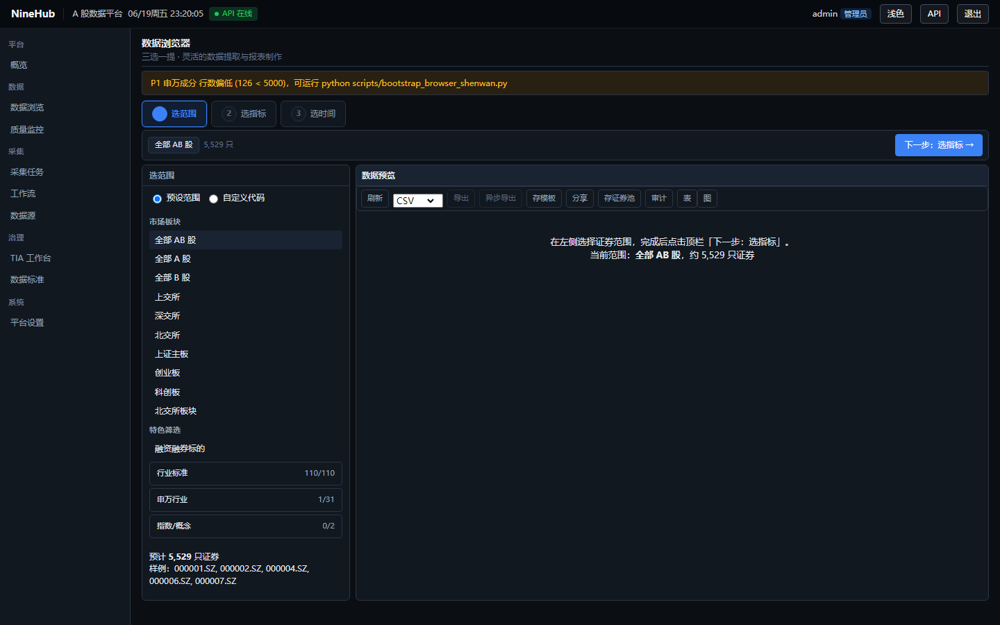

| UI | API |
|----|-----|
| 预设维度（全 A/B/AB、交易所、申万、指数成分等） | `GET /api/v1/query/browser/meta` → `dimensions` |
| 自定义代码列表 | `POST /api/v1/query/browser/universe/preview` |
| 自选股证券池 CRUD | `GET/POST/PUT/DELETE /api/v1/query/browser/watchlists` |

#### 7b. 选指标

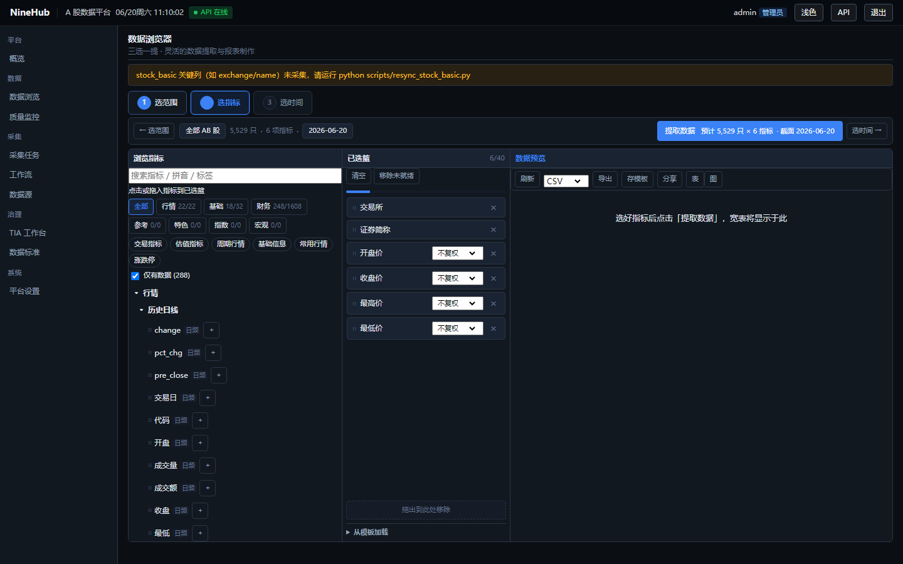

| UI | API |
|----|-----|
| 指标树 / 搜索（拼音、标签） | `GET /api/v1/query/browser/meta`、`GET .../meta/indicators?q=` |
| 系统模板（如 OHLC 演示） | `meta.system_templates` |
| 用户模板 CRUD | `GET/POST/PUT/DELETE /api/v1/query/browser/templates` |

#### 7c. 选时间并提取

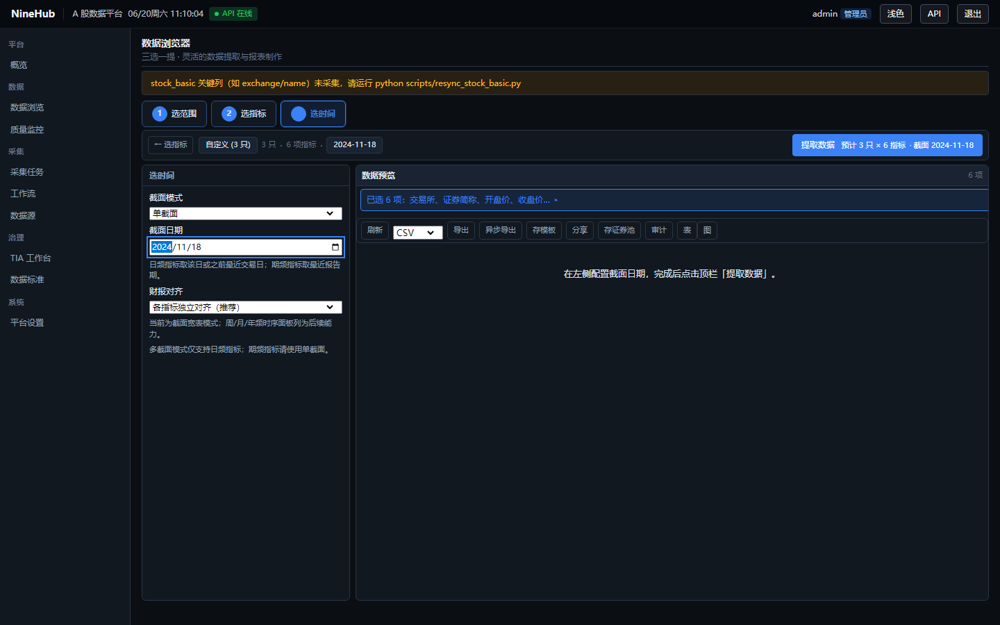

| UI | API |
|----|-----|
| 单/多截面、财报对齐 | 请求体 `as_of_date` / `dates` / `financial_align` |
| P0 就绪门禁（admin 顶栏） | `GET /api/v1/query/browser/readiness` |
| 执行宽表查询 | `POST /api/v1/query/browser/execute` |
| 同步/异步导出 | `POST /api/v1/query/browser/export` → `GET .../exports/{job_id}/download` |
| 分享查询定义 | `POST /api/v1/query/browser/share` → `GET .../share/{token}` |
| 查询审计 | `GET /api/v1/query/browser/audit` |

#### 7d. 结果：表格与图表

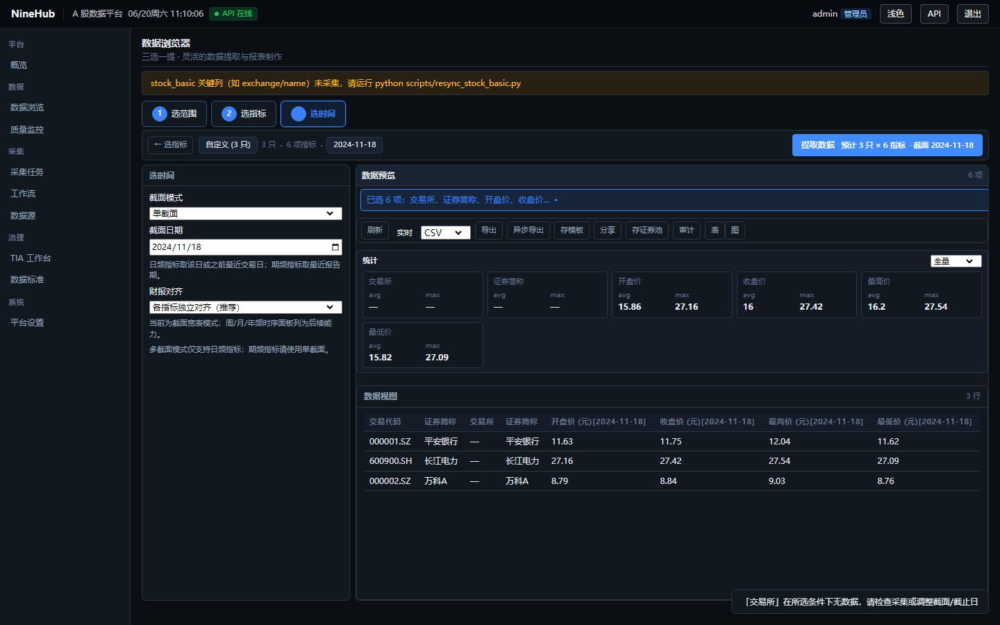

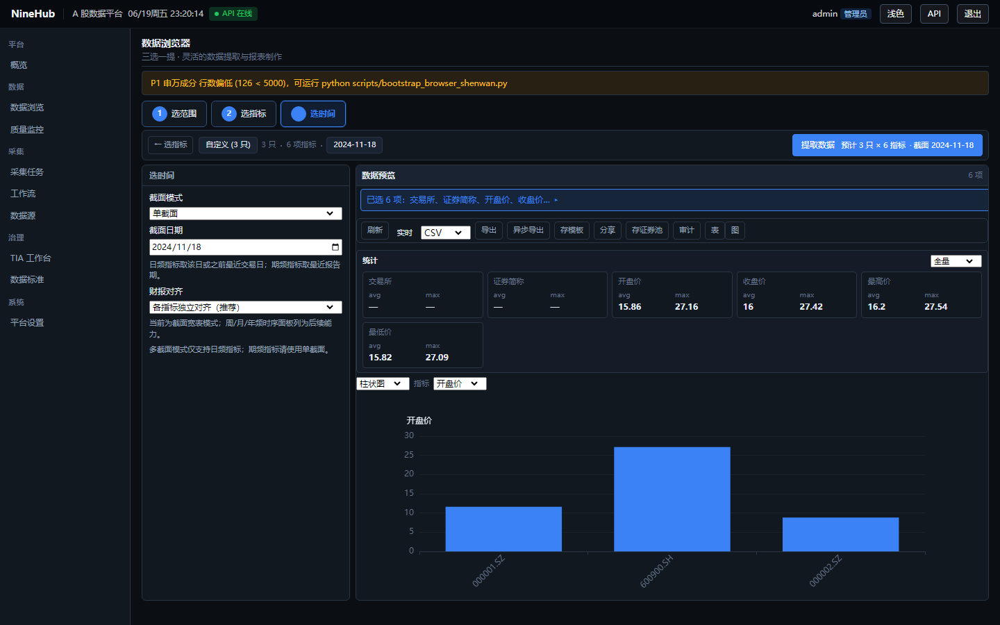

| UI | API |
|----|-----|
| 分页、排序、列统计 | `execute` 请求 `skip` / `limit` / `sort` |
| 柱状/散点/折线（多截面） | 前端 ECharts；数据仍来自 `execute` |
| 强制刷新（跳过缓存） | `execute` + `force_refresh=true` |

**首次部署数据准备**（P0 门禁，admin 可读 readiness）：

```bash
cd backend
python scripts/bootstrap_browser_p0.py      # L3 激活 daily / trade_cal / stock_basic 等
python scripts/backfill_browser_daily.py    # 历史日线回填（可选）
python scripts/check_browser_data_readiness.py
```

P1 申万/指数扩展（非门禁，见 readiness `warnings`）：`bootstrap_browser_shenwan.py`、`bootstrap_browser_index.py`。

与旧版 Catalog 分页浏览（`/browse`，见下节）并存：数据浏览器面向 **多表 join 宽表**；`/browse` 面向 **单事实表 Catalog 分页**。

---

### 8. 数据查询（Catalog 事实表，L3 之后）

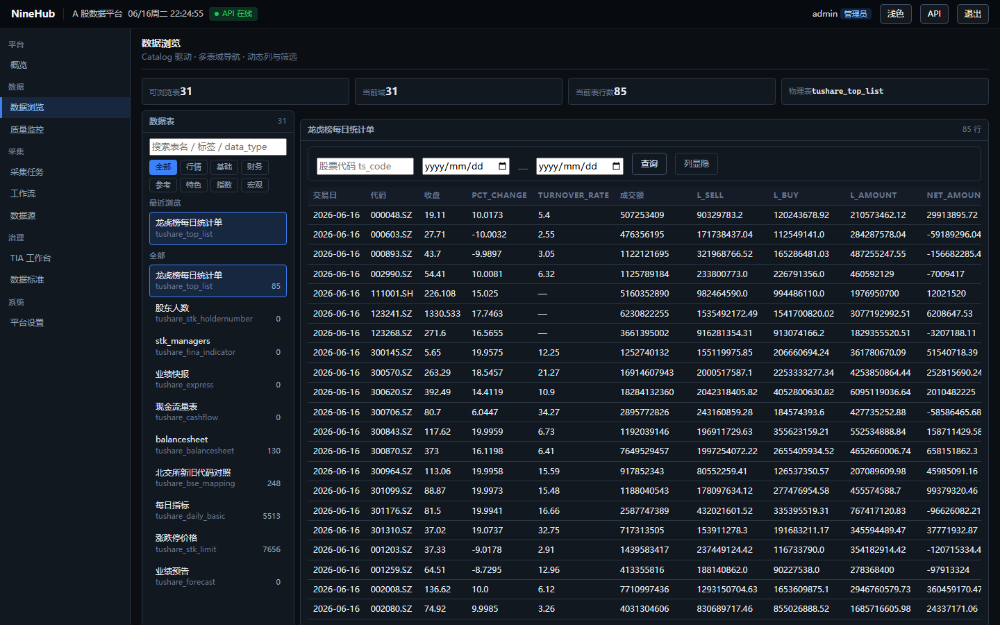

| UI | API |
|----|-----|
| 可查询表清单 | `GET /api/v1/catalog/data-types`（`browse_enabled=true`） |
| 分页查询事实表 | `GET /api/v1/catalog/data/{data_type}?skip=&limit=&...` |

列定义来自 Catalog，禁止前端硬编码业务字段。

---

### 9. 质量监控

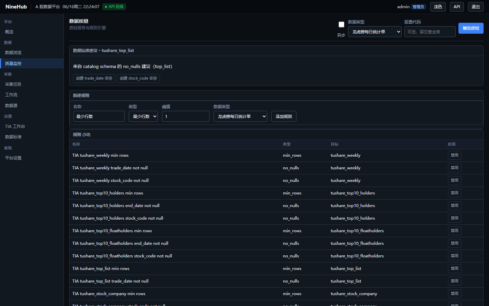

| UI | API |
|----|-----|
| 规则列表 / 新建 | `GET/POST /api/v1/quality/rules` |
| 启用 / 禁用 | `PATCH /api/v1/quality/rules/{id}` |
| Catalog 规则建议 | `GET /api/v1/catalog/data-standards/by-data-type/{data_type}/quality-suggestions` |
| 手动触发质检 | `POST /api/v1/quality/run` |
| 报告分页 | `GET /api/v1/quality/reports` |

Beat 每日 18:00 执行 `ninehub.run_quality_check`；失败可配置 webhook 告警。

---

## 操作线总览

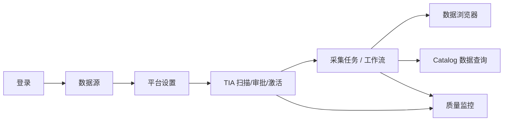

| 阶段 | 后端落点 | 主要表 |
|------|----------|--------|
| 认证 | `app/api/v1/endpoints/auth.py` | `users` |
| 数据源 | `endpoints/sources.py` | `data_sources` |
| TIA | `endpoints/tia.py` + `services/tia/` | `tia_proposals`, `platform_jobs` |
| 采集 | `endpoints/tasks.py` + `sync/` | `sync_tasks`, `task_runs` |
| 工作流 | `endpoints/workflows.py` + `services/workflow/` | `workflows`, `workflow_runs`, `node_runs` |
| 数据浏览器 | `endpoints/query_browser.py` + `services/query/` | `browser_templates`, `browser_watchlists`, `browser_query_audit` + 动态事实表 |
| Catalog 查询 | `endpoints/catalog.py` + Query Engine | 动态事实表 |
| 质检 | `endpoints/quality.py` | `quality_rules`, `quality_reports` |

---

## 代码结构

```
backend/
├── app/
│   ├── api/v1/endpoints/   # auth, catalog, query_browser, sources, tasks, workflows, tia, quality, platform
│   ├── catalog/            # registry, browser_indicators.yaml, tushare_catalog, official_index
│   ├── core/               # config, database, security, deps
│   ├── models/             # SQLAlchemy 模型
│   ├── services/           # 领域服务（按包拆分）
│   ├── sync/               # SyncHandler, SyncExecutor, DataLoader
│   └── tasks/              # Celery 任务定义
├── migrations/             # Alembic
├── scripts/                # init_db.py, setup_collect_workflows.py, run_backfill_history.py 等
├── static/                 # 前端构建产物（生产）
└── tests/
```

---

## 配置（`.env` 摘要）

| 变量 | 说明 |
|------|------|
| `DATABASE_URL` | 异步 API 连接（`postgresql+asyncpg://...`） |
| `SYNC_DATABASE_URL` | Celery 同步连接（`postgresql+psycopg2://...`） |
| `SECRET_KEY` | JWT 签名密钥 |
| `CELERY_BROKER_URL` / `CELERY_RESULT_BACKEND` | Redis |
| `CELERY_INLINE_FALLBACK` | `true` 时 API 进程内同步执行部分任务（本地默认） |
| `BROWSER_QUERY_CACHE_TTL` | 数据浏览器查询结果缓存秒数（默认 300） |
| `TUSHARE_TOKEN` | 脚本回退用 Token（优先读「数据源」配置） |
| `TUSHARE_ACCOUNT_POINTS` | 脚本回退用积分档（默认 120；2000 积分 A 股链路须设为 2000） |
| `WATCH_ALERT_WEBHOOK_URL` | 盯盘 `quote_alert` 外发回退（如 Hermes `http://127.0.0.1:8644/webhooks/ninehub-watch`）；**优先**盯盘 SPA「Hermes 外发」(`/watch/notify`) DB 配置 |
| `WATCH_ALERT_WEBHOOK_SECRET` | 与 URL 成对；Hermes 路由 HMAC secret（UI 也可配置，GET 掩码） |
| `WATCH_ALERT_WEBHOOK_SIGNATURE_VERSION` | `v2`（默认，Hermes Generic V2）或 `v1`（旧网关）；UI 可覆盖 |
| `WATCH_ALERT_WEBHOOK_TIMEOUT_SECONDS` | 外发超时秒数（默认 3；仅 env） |
| `WATCH_REQUIRE_REDIS_LEADER` | 生产推荐 `true`，避免多 worker 双发告警 |

盯盘外发到 Hermes（可选）：`hermes update` → Gateway 启用 Webhook + 手机通道 → 路由 `ninehub-watch` 设 `deliver_only: true`（勿设 `events`）→ `/sethome` → 在盯盘「Hermes 外发」填写 URL/SECRET（或 `.env` 回退；默认签名 V2）。容器内 API 访问宿主机 Gateway 用 `http://host.docker.internal:8644/webhooks/ninehub-watch`。UI「发送测试」对应 `POST /api/v1/platform/watch-alert-webhook/test`。

---

## 建表与迁移

| 层级 | 机制 | 说明 |
|------|------|------|
| 平台表 | Alembic `migrations/versions/` | `init_db.py` 执行 `alembic upgrade head`（当前 head：`020_watch_alert_webhook`） |
| 事实表 | TIA L3 `run_migration` | `migration_service.ensure_table` 按 `schema.columns` + `unique_key_registry` 动态建表 |
| 存量修复 | Alembic 013–015 | 已激活表的约束/列宽补丁（见下表） |

`unique_key_registry.py` 是 L3 建表、upsert、Preflight 的唯一键单一来源。新激活接口走 registry；已上线表通过 Alembic 补丁对齐：

| 迁移 | 表 | 变更 |
|------|-----|------|
| `013_manager_rewards_unique_keys` | `tushare_stk_managers` | 唯一键 `(stock_code, title, begin_date)` |
| `013_manager_rewards_unique_keys` | `tushare_stk_rewards` | 唯一键 `(stock_code, end_date, title)` |
| `014_managers_null_end` | `tushare_stk_managers` | `end_date` 允许 NULL（在任管理层） |
| `015_holder_name_text` | `tushare_stk_holdertrade` | `holder_name` 扩为 TEXT |

新装环境：`init_db` 已含 `alembic upgrade head`（含 013–015）。若在旧版本上做过 L3 激活，再执行 `setup_collect_workflows.py --migrate` 或 `alembic upgrade head` 即可补丁。`schema_inference` 已将 `holder_name` 推断为 `text` 类型。

### 上游接口字段变更

#### `daily` / `pro_bar` 盘后字段（2025-07-07）

交易所交易规则更新后，Tushare [`pro.daily`](https://tushare.pro/document/2?doc_id=27) 新增两个输出字段（默认不显示，全量返回时有值）：

| API 字段 | 平台列 `column.key` | 说明 |
|----------|---------------------|------|
| `ah_vol` | `ah_vol` | 盘后成交量（手） |
| `ah_amount` | `ah_amount` | 盘后成交额（千元） |

通用复权接口 [`pro_bar`](https://tushare.pro/document/2?doc_id=109) 的股票日线指标引用 `daily` 文档，采集时同样可能返回上述列。**`adj_factor`（复权因子）不受影响**。

| 范围 | 说明 |
|------|------|
| 受影响 `data_type` | `tushare_daily`；若已激活 `pro_bar` 则 `tushare_pro_bar` |
| Catalog 模板 | `api_output_fields_registry.py`、`probe_templates.py`（`daily_ohlcv`）、`legacy_schema_registry.json`、`tushare_api_specs_cache.json` |
| 数据浏览器 | `browser_indicators.yaml` 已注册 `tushare_daily.ah_vol` / `tushare_daily.ah_amount` |

**新装环境**：`bootstrap_browser_p0.py` 或 L3 激活 `daily` 时，建表 schema 已含 `ah_vol` / `ah_amount`，日批采集自动落库。

**存量环境**（表已存在、缺列时）：

1. TIA 工作台 → 对应 `daily` 提案 → **Schema 维护** → 执行 `columns` 补列；或调用 API：
   - `GET /api/v1/tia/proposals/{id}/schema-plan`
   - `POST /api/v1/tia/proposals/{id}/schema-apply`（body：`{"modes":["columns"],"confirm_risk":true}`）
2. 补列后触发日批工作流，或对 `tushare_daily` 执行定向回填；历史数据需 `--truncate` 重载或 chunk backfill 方有盘后列值（无盘后成交的标的可能为 NULL）。

**Schema 漂移核对**：`GET /api/v1/catalog/data-standards/daily`、`GET .../drift`。

---

## 2000 积分 A 股采集部署

Tushare **2000 积分**档对应 **200 次/分钟**（见 `source_quota.points_to_max_calls_per_minute`）。工作流日批节点预算 `DAILY_MAX_API_CALLS=200`（`collect_batch.py`），与账号档位一致。多数 A 股接口 `min_points=2000`（doc 页 / `tushare_doc_pages_cache.json`）。

### 1. 数据源

在「数据源」创建 Tushare 连接，**必须**填写：

- `token`：Pro Token
- `account_points`：`2000`

工作流发布校验（E-04）与 Preflight 均读取该积分；勿仅依赖 `.env` 默认 120。

### 2. 平台起始日

「平台设置」→ `sync_start_date`（如 `2020-01-01`）。历史回填与增量采集均以此为下界。

### 3. TIA 治理 → L3 激活

按操作线完成扫描、审批、L3 激活。P0 数据浏览器门禁：

```bash
python scripts/bootstrap_browser_p0.py      # trade_cal / stock_basic / daily 等
python scripts/check_browser_data_readiness.py
```

P1 扩展（申万/指数，各需 ≥2000 积分）：`bootstrap_browser_shenwan.py`、`bootstrap_browser_index.py`。

### 4. 工作流采集配置

L3 激活并创建 `tia_overrides` 后：

- **`apply_workflow_daily_batch.py`**：为 **32** 个 API 写入日批 collect 参数（`DAILY_BATCH_MODE_OVERRIDES`，含 `daily` / `stock_basic` 等）
- **`seed_tia_workflows.py`**：种子 **5 条 published DAG、31 个 collect 节点**（不含 `tushare_daily`；日线由 P0 `bootstrap_browser_p0.py` 或回填 tier 1 覆盖）

一键编排（预检 + 上述两步 + 可选迁移）：

```bash
# 推荐：一键预检 + 写入 override + 种子 5 条 DAG
python scripts/setup_collect_workflows.py --migrate --backfill-plan

python scripts/setup_collect_workflows.py --check-only   # 仅预检（积分 / override 数量）
python scripts/setup_collect_workflows.py --dry-run      # 预览 override 变更
python scripts/setup_collect_workflows.py --replace-workflows  # 重建 01–05 工作流
```

或分步执行：

```bash
python scripts/apply_workflow_daily_batch.py          # 写入 mode / max_codes / max_api_calls
python scripts/apply_workflow_daily_batch.py --dry-run  # 预览
python scripts/seed_tia_workflows.py           # 已存在则跳过
python scripts/seed_tia_workflows.py --replace # 重建
```

工作流 UI 可查看 **Collect Profile**（`GET /api/v1/workflows/collect-profile?data_type=tushare_income&batch_mode=daily`）核对生效策略。

要点（`collect_batch.DAILY_BATCH_MODE_OVERRIDES`）：

- 全市场日频（`daily`、`margin`、`top_list` 等）→ `trade_date` 模式
- 财报类 → `period`（日批最近 2 个报告期）
- 股东/质押等 → `ts_code` 或 `date_range`，每轮轮换 ≤200 代码
- `stk_holdertrade` 接口独立限速 **100 次/分钟**，轮换 chunk 100 代码

### 5. 历史数据回填

全量历史回填命令、tier 分层、续跑与 TDX 导入见上文 [数据初始化与历史加载](#数据初始化与历史加载) 阶段 4。

工作流 `batch_mode=backfill` 单次运行受 200 次 API 预算限制；从 `sync_start_date` 起的全量历史请用 `run_backfill_history.py` 分 chunk 执行。

### 6. 日常运维

- **日增**：Celery Beat 按工作流 Cron（如 `0 18 * * 1-5`）触发；或 UI 手动运行
- **质检**：Beat 每日 18:00 `run_quality_check`
- **Schema 漂移**：TIA 工作台 → Schema 维护（如 `daily` 补列 `ah_vol` / `ah_amount`）；必要时 `alembic upgrade head`

---

## 测试与工具

```bash
# 单元 / 集成测试
pytest tests -v -p no:pytest_postgresql

# 格式化
black app tests

# 数据初始化 / 历史加载（详见上文「数据初始化与历史加载」）
python scripts/setup_collect_workflows.py --check-only
python scripts/setup_collect_workflows.py --migrate --backfill-plan
python scripts/run_backfill_history.py --list
python scripts/bootstrap_tia_apis.py --missing-workflows
python scripts/bootstrap_tdx_bar_1d.py --apis bar_1d concept_index concept_member
python scripts/check_browser_data_readiness.py

# UI 截图（需前端 dev + 本机 API 运行）
python ../scripts/capture_ui_screenshots.py
python ../scripts/capture_browser_screenshots.py   # 数据浏览器三步骤 + 结果
```
